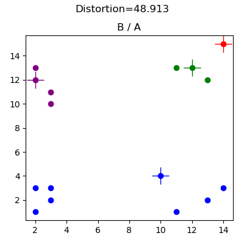

# python-kmeans
python implementation of [k-means clustering](https://en.wikipedia.org/wiki/K-means_clustering).


# Description
k-means attempts to identify a user specified k(<N) number of clusters from a set of N d-dimensional real valued vectors. In lay terms, it attempts to group together similar data points in to a specified number of groups. More specifically the algorithm attempts to minimize the sum of squared distances from a cluster center, to the cluster members. The canonical algorithm proceeds in three phases:

1. Initialise k random centroids (cluster centers);
2. assign data points to nearest cluster according to distance metric (typically Euclidean distance);
3. update the centroids to the mean of the members of the cluster;
4. repeat steps 2 & 3 until the assignments from step 2 do not change.

The output of the algorithm is a cluster assignment for each data point, and a final level of "distortion". The algorithm does not produce a provably optimal solution, and initial cluster centers may cause the algorithm to get stuck in a locally optimum solution that is clearly sub-optimal ([see the basic 2d example](#basic-synthetic-2d-data) in the [Results](#results) section). 

Much research has focused on:
+ selecting initial cluster centers, see [K-Means++]((https://en.wikipedia.org/wiki/K-means%2B%2B)) and the comparative review of initialization methods in the [Resources](#resources) section;
+ and distance metrics, i.e. using measures other than Euclidean see [here](http://citeseerx.ist.psu.edu/viewdoc/download?doi=10.1.1.403.4030&rep=rep1&type=pdf).

## K-Means++
This implementation of k-means includes an implementation of the k-means++ centroid initialization algorithm. Rather than initialize random centroids in step 1 above, k-means++ probabilistically spreads out the initial centroids to avoid poor initial configuration:

1. Choose first centroid randomly.
2. For each data point x, compute the distance d(x), from x to the nearest centroid  that has already been chosen.
3. Select a data point to be the next centroid using a weighted probability probability proportional to d(x)2. 

This technique gives favor to data points which are not near another initial clusters. This technique is reminiscent of [roulette wheel (or fitness proportionate) selection](https://en.wikipedia.org/wiki/Fitness_proportionate_selection) often used in genetic algorithms.


# Resources

## Basic Algorithm 
+ K-Means is described in [Top 10 Algorithms for Data Mining](https://atasehir.bel.tr/Content/Yuklemeler/Dokuman/Dokuman3_4.pdf);

+ K-Means is outlined in [Information Theory, Inference, and Learning Algorithms](http://www.inference.org.uk/mackay/itila/book.html), excerpt [here](http://www.inference.org.uk/mackay/itprnn/ps/284.292.pdf);

+ Professor Andrew Moore of CMU has some good notes [here](https://www.autonlab.org/_media/tutorials/kmeans11.pdf);

+ [Edureka example](https://www.edureka.co/blog/implementing-kmeans-clustering-on-the-crime-dataset/), using crime data

## Initialization of Clusters
+ [K-Means++](https://en.wikipedia.org/wiki/K-means%2B%2B), and full paper [here](http://ilpubs.stanford.edu:8090/778/1/2006-13.pdf)

+ [A Comparative Study of Efficient Initialization Methods for the K-Means
Clustering Algorithm](https://arxiv.org/pdf/1209.1960.pdf)

## Why not use SciPy?
[SciPy](https://scipy.org/) has a k-means [implementation](https://docs.scipy.org/doc/scipy/reference/cluster.vq.html). The objective of this work is to build a pure python implementation for the purposes of learning, and helping others learn the k-means algorithm. Interested readers with only minimal python experience will be able to read, and step over this code without the added complexity of a library such as SciPy. It is not by any means intended for production use :)

# Running the code

## Dependencies
+ python 3.6.3
+ matplotlib 2.1.1 - see [here](https://matplotlib.org/users/installing.html) for installation instructions.

## Execution
Run the code with the python interpreter: 

```python kmeans.py ./resources/<config.cfg>```

Where config.cfg is a plain text configuration file. The format of the config file is a python abstract syntax tree representing a dict with the following fields:

```
{
   'data_file' : '\\resources\\iris.csv',
   'data_project_columns' : ['sepal_length','sepal_width','petal_length','petal_width','class'],
   'k' : 3,
   'cluster_atts' : ['sepal_length','sepal_width','petal_length','petal_width'],
   'init_cluster_func' : 'kmeans_plus_plus',
   'plot_config' :
    {'output_file_prefix' : 'iris',
     'plots_configs': [
        {'plot_atts' : ['sepal_length','sepal_width']},
        {'plot_atts' : ['sepal_length','petal_length']},
        {'plot_atts' : ['sepal_length','petal_width']},
        {'plot_atts' : ['sepal_width','petal_length']},
        {'plot_atts' : ['sepal_width','petal_width']},
        {'plot_atts' : ['sepal_width','petal_width']}
     ]
   }
}
```

You have to specify:
 + a csv data file;
 + a subset of fields to project from the file;
 + the number of clusters to form, k;
 + the subset of attributes used in the clustering process;
 + opti
 + a plot config that includes
    + prefix for png files created during the process in the working directory, if this isn't specified, images will not be produced;
    + the individual plot configurations, limited to 2 dimensions per plot.

 
# Results

## Iris Data Set
The Iris data set ([iris.config](resources/iris.config)), from [Lichman, M. (2013). UCI Machine Learning Repository . Irvine, CA: University of California, School of Information and Computer Science.](http://archive.ics.uci.edu/ml), is a very well known data set in the machine learning community. Here are the results of my random initial clusters:


## Basic Synthetic 2D data
This data was generated for debugging purposes (see [basic2d.config](resources/basic2d.config)), and illustrates the effect of having a poor choice of initial random clusters. The below results demonstrate an initial centroid configuration that prevents the algorithm from reaching the obvious cluster assignment. In this case the placement of the red centroid means the blue centroid captures all of the data points in the lower left, and lower right quadrants.




## Crime
The crime data set ([crime.config](resources/crime.config)) is from [Edureka, here](https://www.edureka.co/blog/implementing-kmeans-clustering-on-the-crime-dataset/).


    


